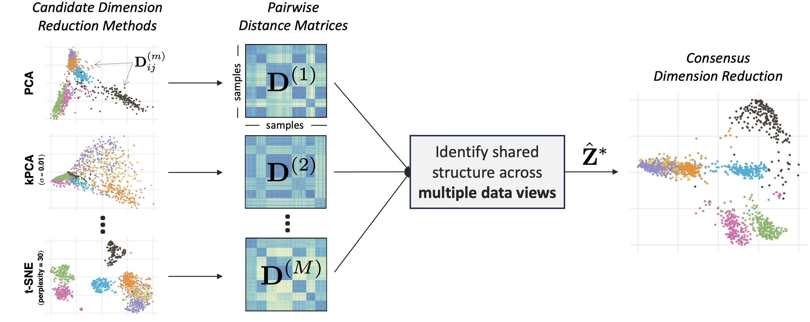

<!-- README.md is generated from README.Rmd. Please edit that file -->

```{r, include = FALSE}
knitr::opts_chunk$set(
  collapse = TRUE,
  message = FALSE,
  warning = FALSE,
  comment = "#>",
  fig.path = file.path("man", "figures", "README-"),
  out.width = "100%"
)
```

# Consensus Multidimensional Scaling



Different dimension reduction methods often output different and possibly conflicting visualizations of the same data. 
This problem is further exacerbated by the choice of hyperparameters, which may substantially impact the resulting visualization.
To obtain a more robust and trustworthy dimension reduction output, we develop a multi-view framework called [Consensus Multidimensional Scaling]() (CoMDS), which summarizes multiple dimension reduction visualizations (e.g., PCA, t-SNE, UMAP) into a single *consensus* visualization.
This consensus visualization captures the common structure that is shared across different dimension reduction methods and hyperparameter settings. 
Such shared structure is likely more reliable than idiosyncratic structures, which are present in only one or a small subset of methods.
In addition to CoMDS, we provide a local variant of CoMDS, *Local Consensus Multidimensional Scaling (LoCoMDS)*, which further enhances robustness by preserving local consensus structures and decreasing the influence of outliers.

## Organization

This repository contains:

1.  An R package `coMDS` to run consensus multidimensional scaling (see [coMDS/](coMDS/))
2.  All code necessary to reproduce the analysis and figures in [An and Tang (2025)]() (see
    [coMDS-manuscript/](coMDS-manuscript/) )

## Installation of the R package

You can install the `coMDS` R package from GitHub via:

``` r
# install.packages("devtools")
devtools::install_github("tiffanymtang/coMDS", subdir = "coMDS")
```

## Example Usage

To illustrate an example usage of `coMDS`, we apply it to the iris dataset, a classic benchmark dataset containing measurements of 150 iris flowers across three species.

```{r}
# load in packages
library(coMDS)
library(dplyr)
library(ggplot2)
library(Rtsne)
library(umap)
library(patchwork)
```

#### Step 1

In this example, we first applied three different dimension reduction methods (i.e., PCA, t-SNE, and UMAP) to the iris dataset.
In many real-world datasets, these dimension reduction methods can yield very different low-dimensional embeddings.

```{r}
data(iris)
# remove duplicates so that t-SNE can run
iris <- dplyr::distinct(iris)
X <- iris[, 1:4]
species <- iris$Species

# fit various dimension reduction methods
pca_scores <- prcomp(X, center = TRUE, scale = TRUE)$x
tsne_scores <- Rtsne::Rtsne(X, dims = 2, perplexity = 30, verbose = FALSE)$Y
umap_scores <- umap::umap(X, n_components = 2, n_neighbors = 30, verbose = FALSE)$layout
dr_list <- list(
  PCA = pca_scores,
  tSNE = tsne_scores,
  UMAP = umap_scores
)
  
# plot the dimension reduction embeddings
purrr::map(
  dr_list, 
  ~ as.data.frame(.x[, 1:2]) |> 
    setNames(paste("Component", 1:2)) |>
    dplyr::mutate(species = species)
) |>
  dplyr::bind_rows(.id = ".method") |>
  ggplot2::ggplot() +
  ggplot2::aes(x = `Component 1`, y = `Component 2`, color = species) +
  ggplot2::geom_point() +
  ggplot2::facet_wrap(~ .method, scales = "free") +
  ggplot2::theme_minimal()
```

#### Step 2: CoMDS

Next, we can use CoMDS to produce a consensus embedding that reflects the shared, stable structure across the input dimension reduction methods. By leveraging multiple views, CoMDS generally provides a more robust and trustworthy low-dimensional embedding than a single method alone.

```{r}
# fit coMDS
comds_out <- coMDS(embed_list = dr_list, ndim = 2)
```

We can visualize the CoMDS consensus embeddings via
```{r}
plot_coMDS(comds_out, color = species)
```
and examine the relative error between each input embedding and the CoMDS consensus embedding via
```{r}
plot_coMDS(comds_out, type = "relative_error")
```

Smaller relative errors indicate that the consensus embedding is more similar to that particular input dimension reduction embedding, relative to the other input dimension reduction embeddings.

#### Step 2: LoCoMDS

Alternatively, LoCoMDS can be applied to the same embeddings to produce a consensus embedding that prioritizes the local consensus structure (as opposed to the global consensus structure in CoMDS). 
LoCoMDS is particularly useful when the input embeddings contain outliers or when the input embeddings themselves are inherently local (e.g., t-SNE, UMAP).
There are two hyperparameters in LoCoMDS: `tau`, which controls the degree of locality, and `percentile`, which controls the threshold for defining local neighborhoods.

```{r}
# fit LoCoMDS with single choice of hyperparameters
locomds_single_out <- locoMDS(
  embed_list = dr_list, ndim = 2, tau = 0.1, percentile = 0.5
)
```

We can visualize the LoCoMDS consensus embeddings via
```{r}
plot_coMDS(locomds_single_out, color = species)
```

and examine the relative error between each input embedding and the CoMDS consensus embedding via
```{r}
plot_coMDS(locomds_single_out, type = "relative_error")
```

LoCoMDS can be run with either a single choice of hyperparameters (as above), or it can be tuned across multiple choices of hyperparameters to select the best consensus embedding.

```{r}
# fit LoCoMDS and tune across multiple choices of hyperparameters
locomds_multi_out <- locoMDS(
  embed_list = dr_list, ndim = 2, tau = c(0.01, 0.1), percentile = c(0.5, 0.8)
)
# tune LoCoMDS output
locomds_tune_out <- tune_locoMDS(locomds_multi_out, data = X)
locomds_tune_out$plot
```

When LoCoMDS is run with multiple choices of hyperparameters, the `tune_locoMDS` function can be used to select the best consensus embedding based on the adjusted local continuity meta-criterion (LCMC).
Higher adjusted LCMC values indicate a better fit.
In this case, it appears that on average across the different LCMC neighborhood sizes, `percentile = 0.8` yields higher adjusted LCMCs than `percentile = 0.5` while the choice of `tau` does not make any noticeable difference.
Given a particular choice of `tau` and `percentile`, we can extract the LoCoMDS consensus embedding with these hyperparameters via 
```{r}
locomds_tuned_out <- extract_locoMDS(locomds_multi_out, tau = 0.1, percentile = 0.8)
```

To plot the tuned LoCoMDS consensus embedding and their corresponding relative errors plot, we can use
```{r}
p1 <- plot_coMDS(locomds_tuned_out, color = species)
p2 <- plot_coMDS(locomds_tuned_out, type = "relative_error")
patchwork::wrap_plots(p1, p2, nrow = 1)
```

We can alternatively examine the consensus embeddings and relative errors for all combinations of hyperparameters via
```{r}
p1 <- plot_coMDS(locomds_multi_out, color = species)
p2 <- plot_coMDS(locomds_multi_out, type = "relative_error")
patchwork::wrap_plots(p1, p2, nrow = 1)
```
